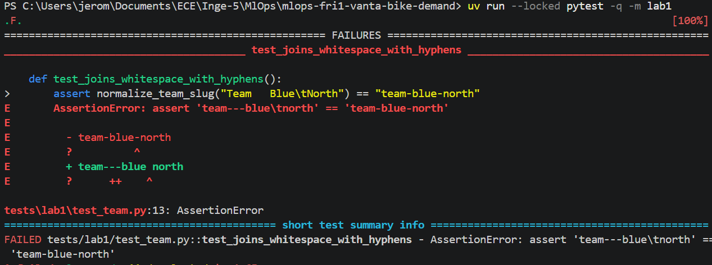
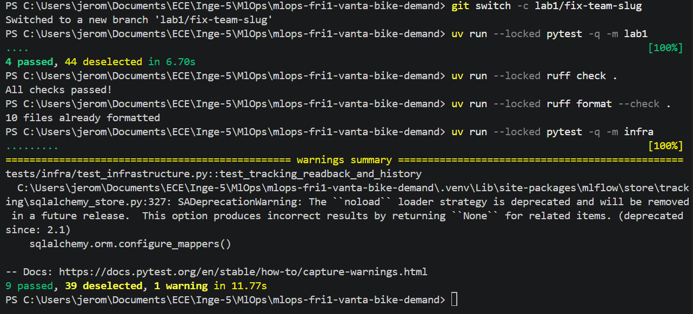

# Lab 1: Team workflow and check record

This team worksheet records observed results. It is separate from the individual Week 1 report.

## Team and setup

- Team/repository: Vanta — https://github.com/Jeromsan/mlops-fri1-vanta-bike-demand.
- Week: Week 1, Lab 1. Execution date: to be added.
- Members: Jeromsan JUDES RAMESH, Merwane KHELOUFI and Yvan FEUGANG.
- Roles: Jeromsan handles the fix and screenshots; Merwane will review the PR before merging.
- Access: private repository; team members and instructor `minhtc-uca` invited by Jeromsan.
- Environment: Windows, PowerShell terminal. Windows version and architecture: to be added.
- Python and uv versions: to be confirmed with `uv run --locked python --version` and `uv --version`. The uv 0.12.23 installer reported success.
- Preflight: `uv run --locked python -m bike_demand.preflight`; result to be confirmed.
- Documents: [working agreement](../WORKING-AGREEMENT.md) and [backlog](../BACKLOG.md).
- Ignored outputs: `.venv/`, `artifacts/` and `tracking/` are listed in `.gitignore`. Files to commit and absence of secrets: to be checked before committing.

## Reviewed change and checks

- Branch: `lab1/fix-team-slug`. Fix commit and PR: pending.
- Fix contributed by Jeromsan: in `src/bike_demand/team.py`, replace `strip().lower().replace(" ", "-")` with `"-".join(team_name.lower().split())`. The function splits words at repeated spaces, tabs and newlines, then joins them with a single hyphen. Blank names are still rejected.
- Added test: `test_normalizes_newlines_and_outer_whitespace`, in `tests/lab1/test_team.py`. It checks newlines and whitespace around the name, adding a case beyond the supplied tests.
- Reviewer: Merwane KHELOUFI. Review observation, author's response and merge: pending.

Local checks:

- `uv run --locked pytest -q -m lab1`, before the fix: `1 failed, 2 passed, 44 deselected`. Failure in `test_joins_whitespace_with_hyphens`.
- `uv run --locked pytest -q -m lab1`, after the fix: `4 passed, 44 deselected in 6.70s`, shown in the after screenshot.
- `uv run --locked pytest -q -m infra`: `9 passed, 39 deselected, 1 warning in 11.77s`. MLflow emitted a SQLAlchemy deprecation warning; no tests failed.
- `uv run --locked ruff check .`: `All checks passed!`, shown in the after screenshot.
- `uv run --locked ruff format --check .`: `10 files already formatted`, shown in the after screenshot.

The initial `lab1` failure was the intended exercise failure. Three spaces produced three hyphens, and the tab remained unchanged. The supplied infrastructure tests pass.

- CI: status and checked commit pending; no remote pass has been documented yet.
- Assistance: instructor's starter; Codex helped explain the error, change the function, add the test and prepare this document. Jeromsan ran the commands and took the screenshots.

## Lab 2 handover

- Next author/reviewer: to be defined.
- Remaining work: confirm preflight and tool versions, then have the PR reviewed before merging.
- Next action: Jeromsan adds the missing results before committing and opening the PR.
- Contribution links for individual reports: to be added after the PR is created.

## Screenshots

Before the fix: `test_joins_whitespace_with_hyphens` fails because repeated spaces and the tab are handled incorrectly. The final result line is cropped in this screenshot; the complete result is recorded above. Commit for this execution: to be identified.

On branch `lab1/fix-team-slug`, after the fix: all 4 `lab1` tests pass, Ruff checks pass, and all 9 `infra` tests pass with one deprecation warning. Fix commit: pending.

PR checks screenshot: to be taken after opening the PR and running CI.
